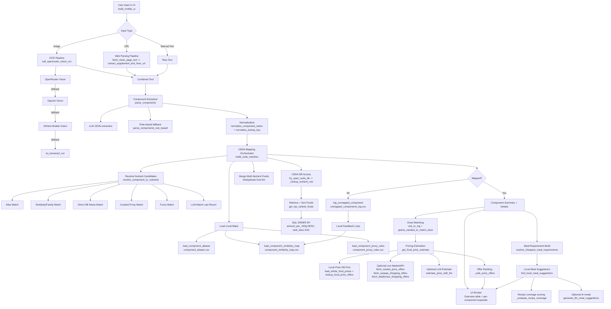

# SuppSwap Architecture Flow (ReAct-style Execution Map)

This diagram shows the end-to-end execution path and the concrete tools/functions used at each stage.

## Data files in this flow
- data/component_aliases.csv
- data/component_similarity_map.csv
- data/component_proxy_rules.csv
- data/unmapped_components_log.csv
- data/usda_rankings.db
- data/whole_food_prices.csv
- data/meal_recipes_local.json
- data/meal_recipes_fitness_pack.json
